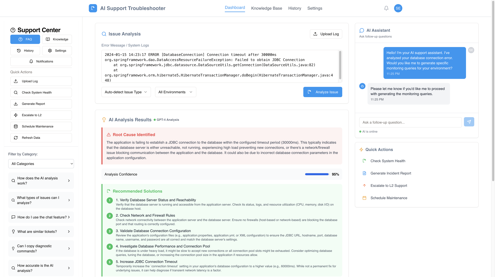

# AI Support Troubleshooter

An advanced AI-powered support troubleshooting application that leverages Google Gemini AI to provide comprehensive issue analysis, interactive problem-solving, and real-time system diagnostics.

https://techsupport.ogelollm.app
 


## 🚀 Features

### Core Functionality
- **AI-Powered Issue Analysis**: Intelligent error log analysis using Google Gemini AI
- **Interactive Chat Support**: Real-time chat assistance for complex troubleshooting
- **Similar Ticket Matching**: Automatically finds related resolved issues
- **Comprehensive FAQ System**: Always-visible left sidebar with knowledge base
- **System Health Monitoring**: Built-in system diagnostic capabilities
- **Incident Report Generation**: Automated report creation and download

### User Interface
- **Permanent FAQ Sidebar**: Always-visible left panel with quick actions
- **Responsive Design**: Modern UI built with React and Tailwind CSS
- **Cross-Component Communication**: Seamless interaction between all UI elements
- **Real-time Updates**: Live chat and analysis results
- **File Upload Support**: Drag-and-drop log file analysis

## 🏗️ Architecture

### Frontend Stack
- **React 18** with TypeScript for type safety
- **Wouter** for lightweight client-side routing
- **Shadcn/UI** components built on Radix UI primitives
- **Tailwind CSS** for utility-first styling
- **TanStack Query** for efficient server state management
- **Vite** for fast development and optimized builds

### Backend Stack
- **Node.js** with Express.js framework
- **Google Gemini AI** integration for intelligent analysis
- **In-memory storage** for development (PostgreSQL-ready with Drizzle ORM)
- **WebSocket support** for real-time chat functionality
- **CORS enabled** for cross-origin requests

### Database & Storage
- **Drizzle ORM** with PostgreSQL schema definitions
- **Shared TypeScript schemas** for type consistency
- **Migration system** with Drizzle Kit
- **Memory storage implementation** for development

## 📁 Project Structure

```
├── client/                 # Frontend React application
│   ├── src/
│   │   ├── components/     # Reusable UI components
│   │   │   ├── ui/        # Shadcn UI component library
│   │   │   ├── analysis-panel.tsx
│   │   │   ├── chat-sidebar.tsx
│   │   │   ├── faq-sidebar.tsx
│   │   │   └── header.tsx
│   │   ├── pages/         # Route components
│   │   ├── hooks/         # Custom React hooks
│   │   └── lib/           # Utility functions and query client
├── server/                # Node.js backend
│   ├── gemini.ts         # Gemini AI integration
│   ├── routes.ts         # API route handlers
│   ├── storage.ts        # Data storage interface
│   └── index.ts          # Express server setup
├── shared/               # Shared TypeScript definitions
│   └── schema.ts         # Database schemas and types
└── python_server/        # Legacy Python Flask server (deprecated)
```

## 🚦 Getting Started

### Prerequisites
- Node.js 18+ 
- npm or yarn package manager
- Google Gemini API key

### Installation

1. **Clone the repository**
   ```bash
   git clone <repository-url>
   cd ai-support-troubleshooter
   ```

2. **Install dependencies**
   ```bash
   npm install
   ```

3. **Set up environment variables**
   ```bash
   # Create .env file with:
   GEMINI_API_KEY=your_gemini_api_key_here
   DATABASE_URL=your_postgresql_url_here  # Optional for development
   ```

4. **Start the development server**
   ```bash
   npm run dev
   ```

5. **Access the application**
   Open [http://localhost:5000](http://localhost:5000) in your browser

## 🔧 Configuration

### Environment Variables
- `GEMINI_API_KEY`: Google Gemini API key for AI analysis (required)
- `DATABASE_URL`: PostgreSQL connection string (optional, uses memory storage if not provided)
- `NODE_ENV`: Environment mode (development/production)

### API Endpoints
- `POST /api/analyze`: Submit issues for AI analysis
- `GET/POST /api/chat`: Chat message handling
- `GET /api/tickets`: Retrieve support tickets
- `GET /api/similar-tickets`: Find similar resolved issues

## 🎯 Key Components

### Analysis Panel
- Main interface for submitting error logs and technical issues
- AI-powered analysis with confidence scoring
- Structured solutions and diagnostic commands
- Auto-detection of issue types and environments

### FAQ Sidebar
- Always-visible left panel with comprehensive support tools
- Quick actions: Upload Log, System Health, Generate Reports
- Navigation sections: Knowledge Base, History, Settings, Notifications
- Cross-component communication with header and analysis panel

### Chat Sidebar
- Real-time chat interface for interactive support
- Session-based message history
- AI-powered responses for follow-up questions
- Integration with analysis results

### Similar Tickets
- Intelligent matching of related past issues
- Confidence scoring for relevance
- Resolution status and details
- Learning from historical data

## 🔄 Data Flow

1. **Issue Submission**: User submits error logs through Analysis Panel or file upload
2. **AI Processing**: Backend sends structured prompts to Google Gemini AI
3. **Result Processing**: AI responses parsed and stored with confidence scores
4. **Similar Matching**: System searches for related historical issues
5. **Real-time Chat**: Users engage in follow-up conversations
6. **Result Display**: Comprehensive solutions and recommendations presented

## 🛠️ Development

### Build Commands
```bash
# Development server
npm run dev

# Production build
npm run build

# Start production server
npm start

# Database migrations
npm run db:push
```

### Code Style
- TypeScript for type safety
- ESLint and Prettier for code formatting
- Modular component architecture
- Shared schemas for consistency

## 🚀 Deployment

### Production Requirements
- PostgreSQL database instance
- Google Gemini API key
- Node.js runtime environment

### Build Process
1. Frontend builds to `/dist/public`
2. Backend bundles to `/dist/index.js`
3. Database migrations applied automatically
4. Static assets served from build directory

### Environment Setup
- Configure `DATABASE_URL` for PostgreSQL
- Set `GEMINI_API_KEY` for AI functionality
- Ensure proper CORS settings for domain

## 🔐 Security

- API key management through environment variables
- Input validation using Zod schemas
- CORS protection for cross-origin requests
- Session-based chat security
- File upload restrictions and validation

## 📈 Performance

- TanStack Query for efficient caching
- Optimized builds with Vite
- Lazy loading for large components
- Memory-efficient storage implementation
- Real-time updates without polling

## 🤝 Contributing

1. Fork the repository
2. Create feature branch (`git checkout -b feature/amazing-feature`)
3. Commit changes (`git commit -m 'Add amazing feature'`)
4. Push to branch (`git push origin feature/amazing-feature`)
5. Open Pull Request

## 📄 License

This project is licensed under the MIT License - see the LICENSE file for details.

## 🆘 Support

For support and questions:
- Check the FAQ section in the application
- Review the documentation in `replit.md`
- Submit issues through the built-in chat system
- Contact the development team

## 🔄 Recent Updates

- Migrated from Python Flask to Node.js with Gemini AI
- Implemented permanent FAQ sidebar as requested
- Fixed all button functionality across components
- Added cross-component communication system
- Enhanced file upload and analysis features
- Improved error handling and user feedback

---

Built with ❤️ using React, Node.js, and Google Gemini AI
